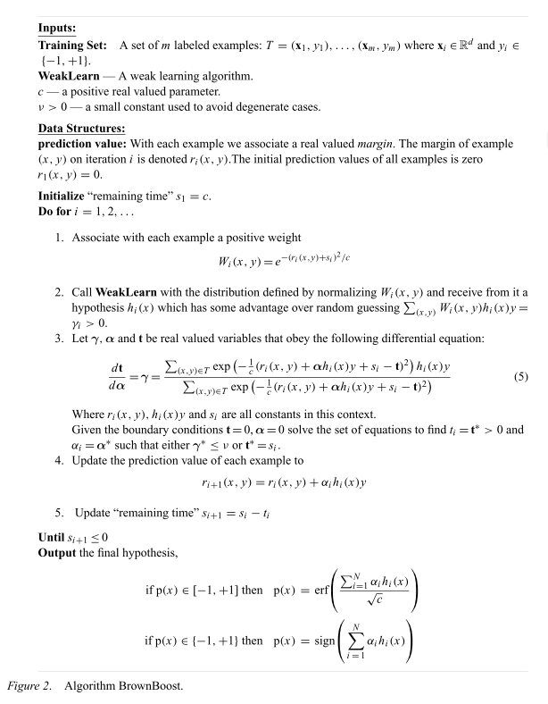

# BrownBoost
- http://lapis-zero09.hatenablog.com/entry/2018/03/30/015819
- Freund, Y.: An adaptive version of the boost by majority algorithm, Machine Learning, vol. 43, no. 3, pp. 293‒318, 2001.
- [https://link.springer.com/article/10.1023/A:1010852229904:embed:cite]

## setting

    Read the docstring
